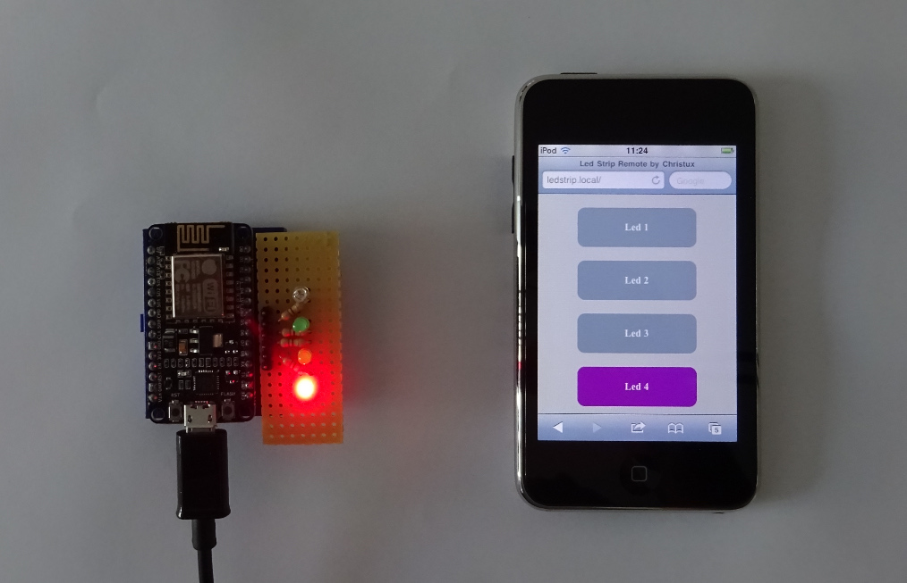

# ESP8266 Led Controller

Copyright (C) 2017 Christux

## Summary :

This app is an ESP8266 led controller example. 
The web app remote is embedded on the flash memory. It is build with a simple JavaScript script. A Json decoder is used in the main app. Multicast DNS is used to advertise the network and access the app thanks to a local domain name. The app is monitored by the serial output. 

## Screenshots :

  

## Links :

<a href="https://www.arduino.cc">https://www.arduino.cc/</a> 
<a href="https://github.com/esp8266/Arduino">https://github.com/esp8266/Arduino</a> 
<a href="https://github.com/bblanchon/ArduinoJson">https://github.com/bblanchon/ArduinoJson</a>

## Keywords :

ArduinoIDE, NodeMCU, ESP8266, ESP8266WiFi, ESP8266WebServer, ESP8266mDNS, ArduinoJson, JavaScript

