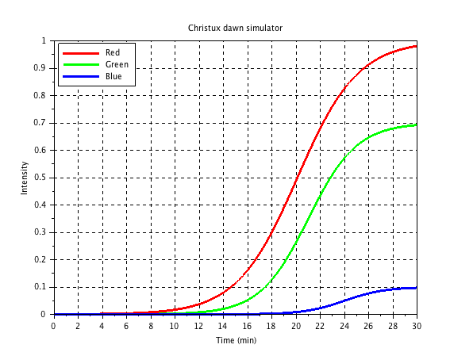

# Dawn Simulator

Copyright (C) 2017 Christux

## Summary :

Here are the equations of the RGB color curves used in the dawn simulator.

  

## See :

<a href="https://en.wikipedia.org/wiki/Dawn_simulation">https://en.wikipedia.org/wiki/Dawn_simulation</a> 

## Keywords :

Dawn simulator, RGB leds, Arduino

