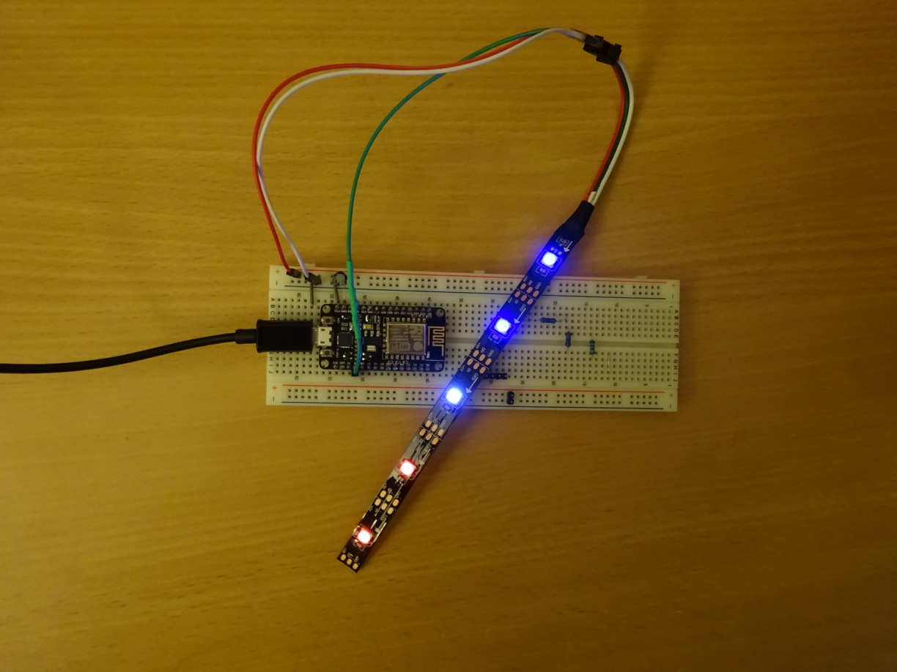

# ESP8266 LedStrip Controller

Copyright (C) 2017 Christux

## Summary :

This app is an ESP8266 ledstrip controller. 
The color of the ledstrip can be setted.
A few animations are avaiable, including KnightRider, rainbow, and a sun rise simulator for smooth wake up !
The web app remote is embedded on the flash memory. You can access to it througth a local domain name (MDNS).

## Installation

The libs you should install on the ArduinoIDE are : 
<a href="https://github.com/Christux/ChristuxUtils">https://github.com/Christux/ChristuxUtils</a> 
<a href="https://github.com/Christux/ChristuxAnimation">https://github.com/Christux/ChristuxAnimation</a>

The web app source code is available here : 
<a href="https://github.com/Christux/Javascript/tree/master/Remote">https://github.com/Christux/Javascript/tree/master/Remote</a> 
A demo of the remote app is presented here : <a href="https://christux.github.io/Javascript/">https://christux.github.io/Javascript/</a>

## Screenshots :

  

## Links :

<a href="https://www.arduino.cc">https://www.arduino.cc/</a> 
<a href="https://github.com/esp8266/Arduino">https://github.com/esp8266/Arduino</a> 
<a href="https://github.com/bblanchon/ArduinoJson">https://github.com/bblanchon/ArduinoJson</a> 
<a href="https://github.com/Makuna/NeoPixelBus">https://github.com/Makuna/NeoPixelBus</a>

## Keywords :

ArduinoIDE, NodeMCU, ESP8266, ESP8266WiFi, ESP8266WebServer, ESP8266mDNS, NeoPixelBus, ChristuxUtils, ChristuxAnimation, ArduinoJson, JavaScript

