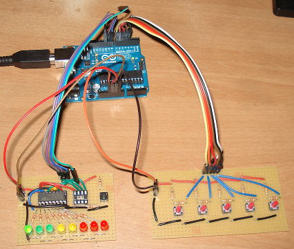

# ShiftRegisterLedStrip

Copyright (C) 2017 Christux

## Summary :

Plays animations on a 8 led strip. 
Animation can be changed by pressing the button or by serial prompt (see test).

## Screenshots :

  

## Links :

See : <a href="https://www.arduino.cc/en/tutorial/ShiftOut">https://www.arduino.cc/en/tutorial/ShiftOut</a>.